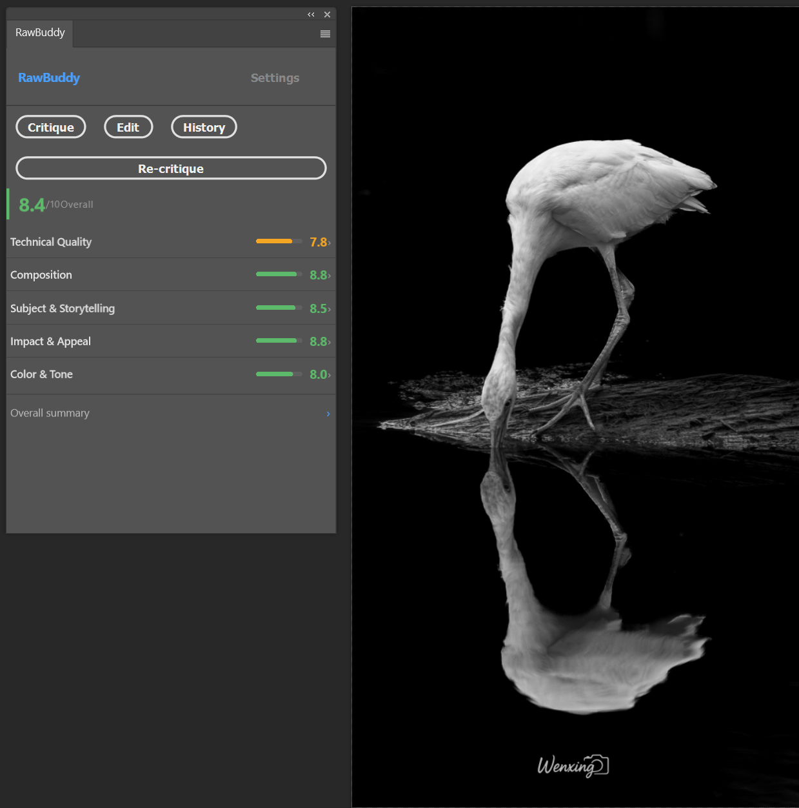
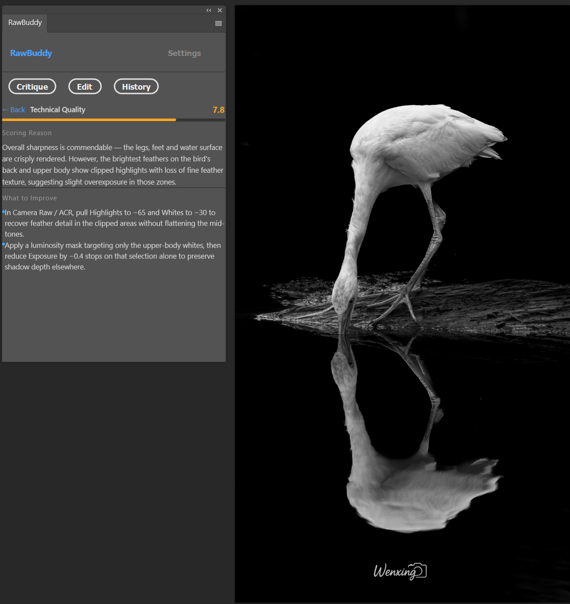

# RawBuddy

A Photoshop UXP panel plugin that lets you edit photos using plain English. Type a command like *"recover the blown-out sky"* or *"make this look like a warm golden hour shot"* and RawBuddy translates it into precise, non-destructive Photoshop adjustment layers — no sliders, no guesswork.

## What it does

RawBuddy has two modes, accessible from the tab bar:

### Critique
Scores your photo against five PSA (Photographic Society of America) judging criteria: Technical Quality, Composition, Subject & Storytelling, Impact & Appeal, and Color & Tone. Each criterion gets a numeric score (1–10) with a colour-coded bar. Tap any criterion to see the scoring reason and specific editing suggestions for that area.

### Edit
Type a plain-English command and RawBuddy translates it into precise, non-destructive Photoshop adjustment layers. It sends your instruction to Claude along with a downsampled preview of your image. Claude visually analyses the photo — assessing exposure, tones, color casts, and mood — then uses that as baseline context when deciding what values to apply. The result is adjustments calibrated to what your image actually looks like, not a generic preset.

Edits are applied as native Photoshop adjustment layers:

- **Brightness/Contrast** — exposure and contrast adjustments
- **Curves** — highlight recovery, shadow lifting, white/black point control
- **Hue/Saturation** — global saturation, hue rotation, lightness
- **Vibrance** — skin-tone-aware saturation boost

---

All edits are non-destructive and fully reversible. No pixels are touched. The image preview sent to Claude is used only for analysis and is never stored or logged. **No generative AI features are ever used** — no Generative Fill, no Neural Filters, no Content-Aware Fill — so your images remain eligible for photo competitions.

## Requirements

- Adobe Photoshop 2026 (v27+)
- An [Anthropic API key](https://console.anthropic.com)
- Adobe UXP Developer Tool (for loading the plugin)

## Setup

```bash
cd plugin
npm install
npm run build
```

Then in the **Adobe UXP Developer Tool**:
1. Add Plugin → select `plugin/manifest.json`
2. Click **Load**
3. In Photoshop: **Window → RawBuddy**
4. Go to the **Settings** tab, enter your Anthropic API key, click **Save Key**

After any code change: `npm run build`, then click **Reload** in UXP Developer Tool.

## Usage

**Critique tab** — click **Critique Photo** with any photo open. RawBuddy scores it across five PSA criteria and shows colour-coded scores. Tap a criterion to read the scoring reason and targeted improvement suggestions.




**Edit tab** — open a photo, select a layer, and type a command. Because RawBuddy sees the actual image, it calibrates values to what's already there rather than applying a generic preset:

- *"The highlights on the water are completely blown — pull them back without flattening the contrast"*
- *"This portrait feels flat and a bit cool, warm up the skin tones and add some depth"*
- *"The subject is well-exposed but the background is distracting — pull it back"*
- *"Shot in harsh midday sun — make it feel like late afternoon golden hour"*
- *"The shadows are crushed and the colors feel muddy, give it some punch"*
- *"This forest shot is green-heavy, desaturate the greens slightly and boost the warmth"*

RawBuddy explains what it changed and logs every edit in the History tab for the session.

## Development

```bash
npm run dev      # unminified build
npm run watch    # watch mode
```

See `CLAUDE.md` for architecture details and hard-won UXP/batchPlay lessons.
